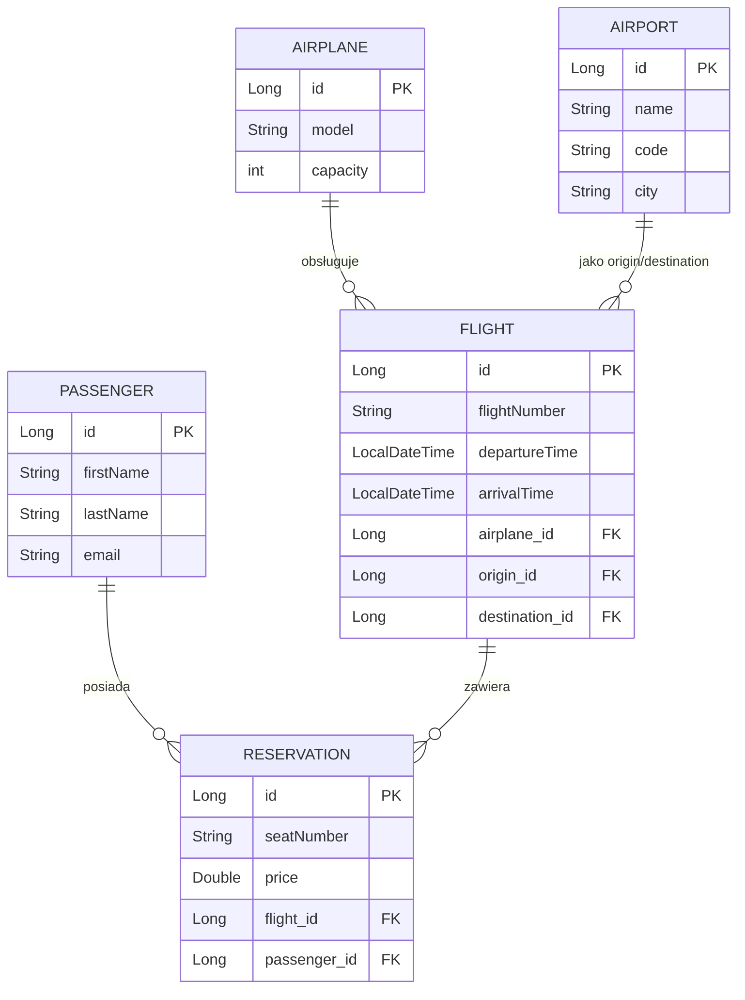

# LinieLotnicze

Projekt system rezerwacji linii lotniczych przygotowany w ramach przedmiotu **TAKE** (Technologie Aplikacji Komponentowych i Enterprise) na 6. semestrze studiów. 

Jest to aplikacja backendowa typu REST API napisana w języku Java z użyciem frameworka Spring Boot, wykorzystująca relacyjną bazę danych H2 (w pamięci) oraz technologie JPA/Hibernate do mapowania obiektowo-relacyjnego. Projekt zawiera także obsługę standardu HATEOAS do dynamicznego generowania odnośników w zasobach.

---

## 🛠️ Stos Technologiczny

Aplikacja została zbudowana przy użyciu następujących technologii i bibliotek:

- **Java 17** – wersja języka programowania.
- **Spring Boot 4.0.5** – główny framework do tworzenia aplikacji webowej i zarządzania zależnościami.
  - **Spring Data JPA** – ułatwione korzystanie z bazy danych za pomocą interfejsów repozytoriów.
  - **Spring MVC** – obsługa żądań HTTP i kontrolerów REST.
  - **Spring HATEOAS** – silnik hipermedialny umożliwiający budowanie interfejsów zgodnych z modelem dojrzałości Richardsona (poziom 3).
- **H2 Database** – lekka, osadzona baza danych działająca w pamięci RAM (`jdbc:h2:mem:testdb`), idealna do celów testowych i deweloperskich.
- **Project Lombok** – deweloperskie ułatwienie generowania konstruktorów (`@RequiredArgsConstructor`), geterów i seterów.
- **Springdoc OpenAPI (Swagger UI)** – automatyczna dokumentacja i testowanie punktów końcowych (endpoints) z poziomu przeglądarki.

---

## 🏗️ Architektura i Struktura Projektu

Projekt zorganizowany jest w warstwowej strukturze pakietów pod główną ścieżką `com.example.linielotnicze`:

1. **Encje Domenowe (Główny pakiet)**:
   - [Airplane.java](./LinieLotnicze/src/main/java/com/example/linielotnicze/Airplane.java) – encja reprezentująca samolot.
   - [Airport.java](./LinieLotnicze/src/main/java/com/example/linielotnicze/Airport.java) – encja reprezentująca lotnisko.
   - [Passenger.java](./LinieLotnicze/src/main/java/com/example/linielotnicze/Passenger.java) – encja reprezentująca pasażera.
   - [Flight.java](./LinieLotnicze/src/main/java/com/example/linielotnicze/Flight.java) – encja reprezentująca lot.
   - [Reservation.java](./LinieLotnicze/src/main/java/com/example/linielotnicze/Reservation.java) – encja reprezentująca rezerwację.

2. **Warstwa Repozytoriów (`repository`)**:
   - Interfejsy `CrudRepository` z zapytaniami JPA.

3. **Warstwa Usług (`service`)**:
   - Klasy serwisów realizujące transakcyjną logikę biznesową (oznaczone `@Transactional`).

4. **Warstwa Kontrolerów REST (`controller`)**:
   - Udostępnia punkty końcowe HTTP dla wszystkich zasobów w liczbie mnogiej (`/flights`, `/airports`, `/passengers`, `/reservations`, `/airplanes`), z pełnym wsparciem wstrzykiwania zależności przez konstruktor.

5. **Wyjątki (`exception`)**:
   - Zawiera własny, lekki wyjątek `ResourceNotFoundException.java` używany przy braku obiektów i obsługiwany przez `GlobalExceptionHandler.java`.

---

## 📊 Model Danych i Relacje



---

## ⚡ Punkty Końcowe (Endpoints) API

Zgodnie z najlepszymi praktykami RESTful API:
- Nazwy zasobów są w **liczbie mnogiej** (np. `/flights`).
- Metody `GET` domyślnie zwracają dane opakowane w obiekty **DTO z linkami HATEOAS**.
- Tworzenie zasobów (`POST`) zwraca kod **`201 Created`** wraz z nagłówkiem `Location`.
- Aktualizacja zasobów (`PUT`) przyjmuje identyfikator w ścieżce (np. `PUT /flights/{id}`) i zwraca kod `200 OK`.
- Usuwanie zasobów (`DELETE`) zwraca kod **`204 No Content`**.

### ✈️ Loty (`/flights`)
Pobiera listę lotów w standardzie HATEOAS (parametry są opcjonalne):
- `origin` (String) – wyszukuje loty rozpoczynające się w podanym mieście.
- `destination` (String) – wyszukuje loty kończące się w podanym mieście.
- `flightNumber` (String) – wyszukuje lot o podanym numerze.
- `sortBy` (String) – przekazanie `departureTime` sortuje loty chronologicznie według czasu odlotu.

*Przykłady:*
- `POST /flights` $\rightarrow$ status `201 Created` (utworzenie lotu)
- `GET /flights` $\rightarrow$ status `200 OK` (lista wszystkich lotów z odnośnikami)
- `GET /flights/1` $\rightarrow$ status `200 OK` (szczegóły lotu o ID 1 z HATEOAS self-link)
- `PUT /flights/1` $\rightarrow$ status `200 OK` (aktualizacja lotu)
- `DELETE /flights/1` $\rightarrow$ status `204 No Content` (usunięcie lotu)
- `GET /flights/1/airplane` $\rightarrow$ pobiera samolot przypisany do lotu.
- `GET /flights/1/origin` $\rightarrow$ pobiera lotnisko odlotu.
- `GET /flights/1/destination` $\rightarrow$ pobiera lotnisko przylotu.

### 🏛️ Lotniska (`/airports`)
Pobiera listę lotnisk w standardzie HATEOAS (parametry opcjonalne):
- `code` (String) – wyszukuje lotnisko o podanym kodzie IATA (np. `WAW`).
- `city` (String) – wyszukuje lotniska w podanym mieście.
- `nameFragment` (String) – wyszukuje lotniska zawierające podaną frazę w nazwie.
- `sortBy` (String) – przekazanie `city` sortuje lotniska alfabetycznie po mieście.

### 👥 Pasażerowie (`/passengers`)
Pobiera listę pasażerów w standardzie HATEOAS (parametry opcjonalne):
- `lastName` (String) – wyszukuje pasażerów o danym nazwisku.
- `firstName` (String) – w połączeniu z `lastName` do wyszukiwania osób o danym imieniu lub nazwisku.
- `emailFragment` (String) – wyszukuje pasażerów po fragmencie e-maila.
- `sortBy` (String) – przekazanie `lastName` sortuje pasażerów alfabetycznie według nazwiska.

### 🎫 Rezerwacje (`/reservations`)
Pobiera listę rezerwacji w standardzie HATEOAS (parametry opcjonalne):
- `flightNumber` (String) – rezerwacje dla podanego numeru lotu.
- `city` (String) – rezerwacje na loty do podanego miasta docelowego.
- `email` (String) – rezerwacje pasażera o podanym e-mailu.
- `maxPrice` (Double) – rezerwacje o cenie mniejszej lub równej podanej kwocie.
- `lastName` (String) – rezerwacje pasażerów o podanym nazwisku.
- `sortBy` (String) – przekazanie `seatNumber` (w połączeniu z `flightNumber`) sortuje rezerwacje rosnąco według numeru siedzenia.

*Uwaga:* Endpoint `GET /reservations/count?flightNumber={flightNumber}` zwraca liczbę zajętych miejsc na dany lot.

### 🛸 Samoloty (`/airplanes`)
Pobiera listę samolotów w standardzie HATEOAS (parametry opcjonalne):
- `minCapacity` (Integer) – samoloty o pojemności większej lub równej podanej wartości.
- `maxCapacity` (Integer) – w połączeniu z `minCapacity` definiuje przedział pojemności.
- `modelFragment` (String) – wyszukuje samoloty zawierające podaną frazę w nazwie modelu.
- `sortBy` (String) – przekazanie `capacity` sortuje samoloty od największego do najmniejszego.

---

## 💾 Inicjalizacja Danych

Baza danych H2 jest automatycznie zasilana przy każdym starcie aplikacji danymi testowymi znajdującymi się w pliku [data.sql](./LinieLotnicze/src/main/resources/data.sql). Zawiera on wstępnie zdefiniowane samoloty, lotniska, pasażerów, rejsy oraz rezerwacje miejsc.

Konfiguracja znajduje się w pliku [application.properties](./LinieLotnicze/src/main/resources/application.properties).

---

## 🚀 Jak uruchomić projekt?

### Wymagania wstępne
- Zainstalowane środowisko **JDK 17** (lub nowsze).
- Zainstalowany **Maven** (lub można użyć dołączonego wrappera `mvnw`).

### Kroki do uruchomienia
1. Wejdź do katalogu projektu Maven:
   ```bash
   cd LinieLotnicze
   ```
2. Skompiluj i uruchom aplikację za pomocą Maven:
   ```bash
   ./mvnw spring-boot:run
   ```
   *(Na systemie Windows użyj komendy `mvnw.cmd spring-boot:run`)*

3. Po uruchomieniu aplikacja będzie dostępna pod adresem: `http://localhost:8080`

### 🔍 Przydatne linki lokalne
* **Interfejs Swagger UI (Dokumentacja API)**: [http://localhost:8080/swagger-ui/index.html](http://localhost:8080/swagger-ui/index.html) – pozwala na interaktywne testowanie wszystkich punktów końcowych.
* **Konsola bazy danych H2**: [http://localhost:8080/h2-console](http://localhost:8080/h2-console)
  * **JDBC URL**: `jdbc:h2:mem:testdb`
  * **User Name**: `sa`
  * **Password**: *(pozostaw puste)*
